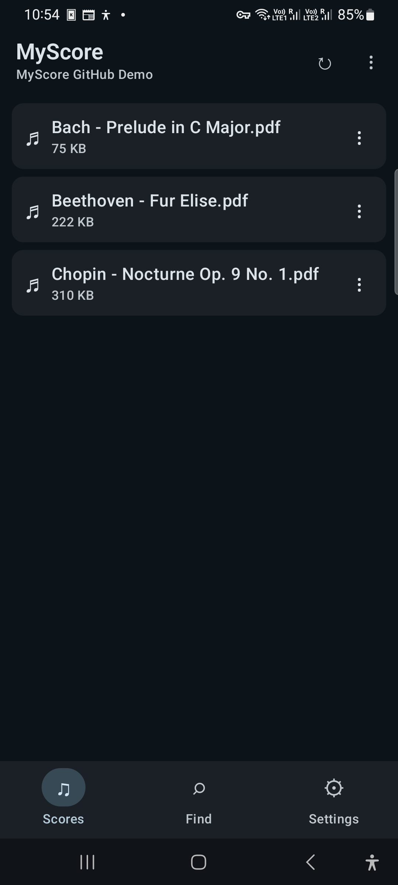
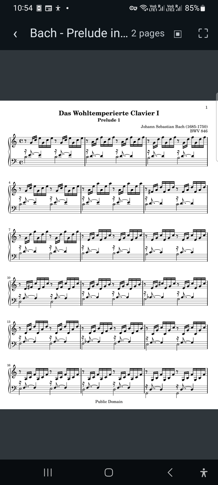
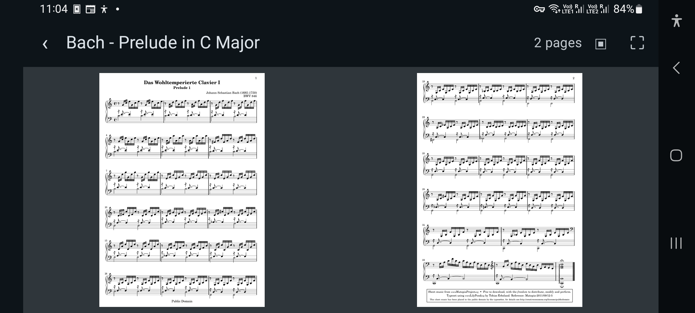

# MyScore

A local-first, root-confined Android sheet-music file browser and PDF reader built with Kotlin and Jetpack Compose.

## Highlights

<p align="center">
  
  
</p>
<p align="center">
  
</p>

Browse a folder of scores, then open a PDF in the focused, swipeable reader with single- and two-page layouts. These screenshots were captured on a Samsung Galaxy A32 using J. S. Bach's public-domain [Prelude in C major, BWV 846](https://www.mutopiaproject.org/cgibin/piece-info.cgi?id=5) from the Mutopia Project.

## Run

Open the repository in a current Android Studio release, or build from the command line:

```sh
./gradlew assembleDebug
```

The app targets Android API 37 and requires Android 6.0 (API 23) or newer.

Run JVM and connected-device tests with:

```sh
./gradlew testDebugUnitTest
./gradlew connectedDebugAndroidTest
```

Release APKs are intentionally signed with the checked-in disposable debug key; see the architecture record before distributing them.

See [the product and architecture record](docs/PRODUCT_AND_ARCHITECTURE.md) for scope, decisions, and next steps.
